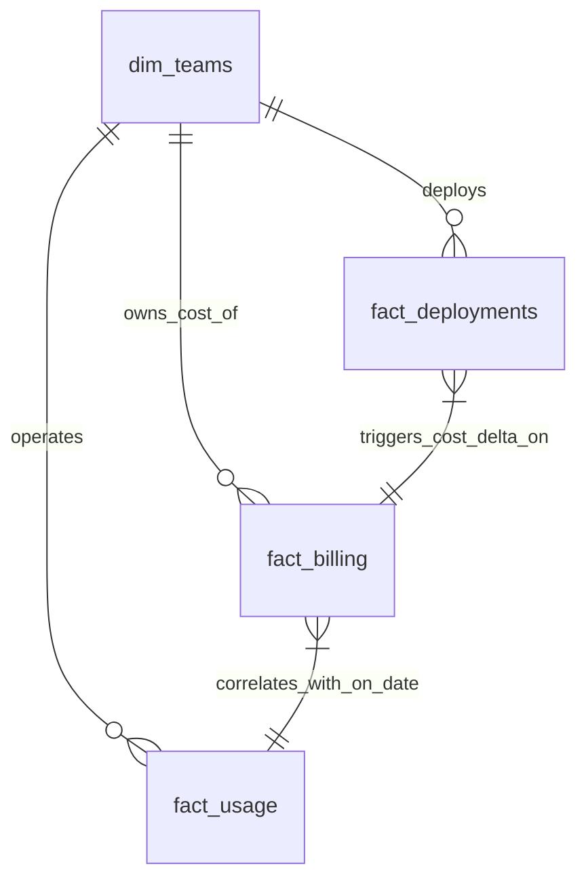

# 📊 Data Model Specification

## CostLens AI — Cloud Cost Intelligence & Root Cause Analysis Platform

---

| Field             | Detail                                           |
| ----------------- | ------------------------------------------------ |
| **Document ID**   | CLAI-DM-001                                      |
| **Version**       | 1.0.0                                            |
| **Status**        | Approved                                         |
| **Created**       | 2026-06-29                                       |
| **Last Updated**  | 2026-06-29                                       |
| **Document Type** | Data Model & Schema Specification                |
| **Project**       | CostLens AI                                      |
| **Tech Stack**    | Pandas · SQLite / PostgreSQL · Power BI          |

---

## 1. Data Model Overview

CostLens AI utilizes a hybrid analytical modeling approach designed to balance transactional analysis (e.g., deployments, config changes) and time-series aggregation (e.g., billing, usage metrics).

The architecture organizes data into three distinct layers:
- **Raw Layer (Landing):** Direct file ingestion imports. Minimal structure validation.
- **Processed Layer (Conformed):** Normalized tables with enforced types, unified keys, and primary/foreign key definitions.
- **Analytics Layer (Semantic):** Star schema optimized for Streamlit dashboards, SQL-based KPIs, and ML feature stores.

```
+--------------------+
|  Raw Ingestion     | CSV / JSON Sources
+---------+----------+
          |
          v (Cleaning & Structuring)
+--------------------+
|  Conformed Layer   | Normalized relational tables
+---------+----------+
          |
          v (Data Pipeline Transformation)
+--------------------+
|  Semantic Layer    | Star Schema (Fact & Dimension Tables)
+--------------------+
```

---

## 2. Business Entities

The analytical domain is defined by five key business entities:

- **Service:** The basic deployment boundary or software product (e.g., `Checkout API`, `Recommendation Engine`).
- **Team / Cost Center:** The organizational unit accountable for the budget, resources, and deployments of a service.
- **Deployment:** A discrete version change event applied to a service.
- **Resource Usage:** Performance and capacity metric profiles (CPU, memory, requests) generated by a service over time.
- **Billing record:** The daily cost cost allocated to running service infrastructure resources.

---

## 3. Dataset Inventory

For the MVP validation and testing, the data model supports four source datasets:

| Filename | Format | Update Frequency | Description |
|---|---|---|---|
| `dim_teams.csv` | CSV | Ad-hoc (Config-driven) | Maps services to owning teams and organizational cost centers. |
| `fact_billing.csv` | CSV | Daily Batch | Detailed daily cloud spend records categorized by service and environment. |
| `fact_deployments.csv` | CSV | Daily Batch | Logs deployment versions, status, timestamps, and deployment triggers. |
| `fact_usage.csv` | CSV | Daily Batch | Tracks infrastructure metrics, storage allocations, and traffic demand volume. |

---

## 4. Table Definitions & Relationships

### 4.1 ER Diagram (Crow's Foot Notation)



---

## 5. Data Dictionary & Table Schemas

### 5.1 `dim_teams` (Dimension Table)
Stores organizational context and responsibility mappings.

| Column Name | Data Type (SQL) | Pandas Type | Constraints | Description |
|---|---|---|---|---|
| `service_name` | `VARCHAR(100)` | `string` | PRIMARY KEY | Unique name of the service identifier |
| `team_name` | `VARCHAR(100)` | `string` | NOT NULL | Owning engineering or product team |
| `team_lead` | `VARCHAR(100)` | `string` | NULLABLE | Primary point of contact for optimizations |
| `cost_center` | `VARCHAR(50)` | `string` | NOT NULL | Financial ledger allocation ID |

### 5.2 `fact_billing` (Fact Table)
Stores daily granular spending records.

| Column Name | Data Type (SQL) | Pandas Type | Constraints | Description |
|---|---|---|---|---|
| `billing_id` | `VARCHAR(50)` | `string` | PRIMARY KEY | Unique tracking record ID |
| `date` | `DATE` | `datetime64[ns]` | NOT NULL | Billing reporting date |
| `service_name` | `VARCHAR(100)` | `string` | FOREIGN KEY | References `dim_teams.service_name` |
| `environment` | `VARCHAR(50)` | `string` | NOT NULL | Environment tier (`prod`, `staging`, `dev`) |
| `cost_usd` | `DECIMAL(10,2)` | `float64` | NOT NULL | Daily cost in USD |
| `project_id` | `VARCHAR(50)` | `string` | NOT NULL | Cloud platform project/account identifier |

### 5.3 `fact_deployments` (Fact Table)
Stores release history events.

| Column Name | Data Type (SQL) | Pandas Type | Constraints | Description |
|---|---|---|---|---|
| `deployment_id` | `VARCHAR(50)` | `string` | PRIMARY KEY | Unique tracking deployment ID |
| `timestamp` | `TIMESTAMP` | `datetime64[ns]`| NOT NULL | Exact system release timestamp |
| `service_name` | `VARCHAR(100)` | `string` | FOREIGN KEY | References `dim_teams.service_name` |
| `version` | `VARCHAR(20)` | `string` | NOT NULL | Target semver string |
| `environment` | `VARCHAR(50)` | `string` | NOT NULL | Target deployment target |
| `status` | `VARCHAR(20)` | `string` | NOT NULL | Deployment outcome (`success`, `failed`, `rollback`) |
| `deployed_by` | `VARCHAR(100)` | `string` | NULLABLE | Operator email or pipeline automation runner |

### 5.4 `fact_usage` (Fact Table)
Stores resource utilization logs.

| Column Name | Data Type (SQL) | Pandas Type | Constraints | Description |
|---|---|---|---|---|
| `usage_id` | `VARCHAR(50)` | `string` | PRIMARY KEY | Unique tracking record ID |
| `date` | `DATE` | `datetime64[ns]` | NOT NULL | Performance evaluation date |
| `service_name` | `VARCHAR(100)` | `string` | FOREIGN KEY | References `dim_teams.service_name` |
| `cpu_utilization` | `DECIMAL(5,2)` | `float64` | NOT NULL | Average CPU usage percentage |
| `memory_gb` | `DECIMAL(6,2)` | `float64` | NOT NULL | Average memory allocation in GB |
| `requests_count` | `INTEGER` | `int64` | NOT NULL | Total request volume traffic |
| `storage_gb` | `DECIMAL(8,2)` | `float64` | NOT NULL | Storage footprint |

---

## 6. Data Integrity & Constraints (Foreign Keys)

- `fact_billing.service_name` must refer to `dim_teams.service_name`.
- `fact_deployments.service_name` must refer to `dim_teams.service_name`.
- `fact_usage.service_name` must refer to `dim_teams.service_name`.

---

## 7. Sample Records

### 7.1 `dim_teams`
| service_name | team_name | team_lead | cost_center |
|---|---|---|---|
| `Checkout API` | `Payments Team` | `alice@company.com` | `CC-PAY-401` |
| `Search API` | `Discovery Team` | `bob@company.com` | `CC-DSC-204` |

### 7.2 `fact_billing`
| billing_id | date | service_name | environment | cost_usd | project_id |
|---|---|---|---|---|---|
| `b_checkout_20260101` | `2026-01-01` | `Checkout API` | `prod` | `1200.00` | `gcp-prod-payments` |
| `b_search_20260101` | `2026-01-01` | `Search API` | `prod` | `450.00` | `gcp-prod-discovery` |

### 7.3 `fact_deployments`
| deployment_id | timestamp | service_name | version | environment | status | deployed_by |
|---|---|---|---|---|---|---|
| `d_checkout_v2.1` | `2026-01-01 10:15:00` | `Checkout API` | `v2.1` | `prod` | `success` | `pipeline-runner@cicd` |

### 7.4 `fact_usage`
| usage_id | date | service_name | cpu_utilization | memory_gb | requests_count | storage_gb |
|---|---|---|---|---|---|---|
| `u_checkout_20260101` | `2026-01-01` | `Checkout API` | `65.40` | `32.00` | `1200000` | `500.00` |

---

## 8. Data Assumptions

1. **Daily Grain Representation:** Cost and performance metrics are analyzed at a daily granularity. Real-time sub-hour data is aggregated up before ingestion.
2. **Standard Currency:** Cost data is reported in US Dollars ($) to align with platform API standardization.
3. **Valid Relationship:** Any cloud service logging resource usage or billing charges must have a corresponding entry in `dim_teams` to enable cost ownership attribution.

---

## 9. Data Quality Risks & Mitigation Strategies

| Data Risk | Description | Platform Impact | Mitigation Strategy |
|---|---|---|---|
| **Orphaned Services** | Cloud resources lack matching service/team mapping | Breaks attribution calculations | Pipeline defaults unmapped services to `Unattributed_Service` and routes to `FinOps_Holding_Center`. |
| **Missing Deployment Logs** | Incomplete logs during CI/CD downtime | Unable to perform Root Cause Analysis for spikes | Perform time-based checks. Flag potential missed events if anomalous delta lacks a matching event marker. |
| **Out-of-Order Records** | Late arriving billing records | Under-reporting spend levels | Ingest data using upsert strategies on `billing_id` and apply window functions to fill data gaps. |
